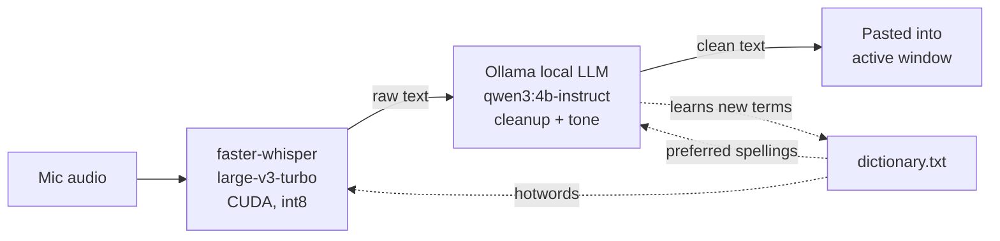

# WhisprFlow 


A local, private clone of [Wispr Flow](https://wisprflow.ai). Hold a hotkey, speak,
release, and clean, formatted text is typed into whatever app you're focused on.
No cloud, no subscription, no audio ever leaves your machine.

Built entirely on consumer hardware: an **RTX 4050 laptop GPU (6 GB VRAM)**.


## What it does

1. **Hold F9** → a floating pill appears at the bottom of your screen with a live waveform.
2. **Speak, then release F9** → your speech is transcribed locally on the GPU.
3. A local LLM cleans the transcript up: removes "um"/"uh", fixes grammar and
   punctuation, applies your self-corrections, and lightly matches tone to the app
   you're typing into.
4. The cleaned text is pasted into your active window automatically.

It also **learns as you use it**: after every dictation, a background pass extracts
proper nouns, acronyms, and jargon you said, and remembers them so future dictations
spell your names and terms correctly.

## How it compares to Wispr Flow

| | WhisprFlow Clone | Wispr Flow |
|---|---|---|
| **Price** | Free | ~$15/mo |
| **Where it runs** | 100% local on your GPU | Cloud |
| **Audio leaves your machine** | Never | Uploaded for transcription |
| **Works offline** | Yes | No |
| **Transcription latency** | ~1s (Whisper on CUDA) | Sub-second (cloud) |
| **AI cleanup latency** | ~3-4s (local LLM) | Included in ~700ms end-to-end |
| **VRAM footprint** | ~4 GB (both models resident) | N/A (server-side) |
| **Adaptive dictionary** | Yes, learns locally | Yes |
| **Customizable** | Fully, it's your code | No |

The trade is honest: a cloud service optimized on datacenter GPUs is faster end-to-end.
What you get back is zero cost, zero data exfiltration, offline capability, and full
control, running on a 6 GB laptop GPU.

## Why this exists

Wispr Flow is a commercial dictation app. Its own documentation and
[a case study from its infra provider](https://www.baseten.co/resources/customers/wispr-flow/)
describe a two-stage pipeline: a Whisper-class speech recognizer produces a raw
transcript, then a fine-tuned Llama model rewrites it, stripping fillers, applying
corrections, and matching tone, in under ~700ms. This project rebuilds that same
two-stage idea with fully open, local models, so it runs offline with no per-word
cost and no audio sent anywhere.

## Architecture



- **ASR:** [faster-whisper](https://github.com/SYSTRAN/faster-whisper), running
  `large-v3-turbo` on CUDA at `int8_float16` precision. This quantization was the key
  decision for a 6 GB card: full-precision `large-v3` doesn't comfortably fit alongside
  an LLM, but the int8 quantized turbo model uses only ~1.5 GB VRAM with negligible
  accuracy loss.
- **Cleanup:** [Ollama](https://ollama.com) running `qwen3:4b-instruct` (2.5 GB VRAM).
  This specific model was chosen after testing three alternatives, see
  [Decisions & trade-offs](#decisions--trade-offs) below for why.
- **UI:** a borderless, click-through `tkinter` pill window (stdlib only, no UI
  framework) that renders a live waveform while recording and pulsing dots while
  processing.
- **Packaging:** [PyInstaller](https://pyinstaller.org) bundles the app plus the CUDA
  runtime DLLs into a standalone `WhisprFlow.exe`, no Python install required to run it.

## Decisions & trade-offs

Building this surfaced a few non-obvious problems worth knowing about if you extend it:

**Whisper model size.** `large-v3-turbo` at `int8_float16` was chosen specifically to
fit a 6 GB card alongside a second (LLM) model in VRAM at the same time. If you have
more VRAM, `large-v3` gives marginally better accuracy at the cost of ~3x the memory.

**Cleanup model: three candidates tested.**
| Model | Result |
|---|---|
| `llama3.2:3b` | Fast, but flattened questions into commands ("can you send the file" → "Send the file"). An instruction-following ceiling, not a prompt problem. |
| `qwen3:4b` (thinking) | Perfect fidelity, but "thought" for 80–140 seconds per sentence and ignored `/no_think`. Unusable for real-time dictation. |
| **`qwen3:4b-instruct`** | Same fidelity as the thinking variant, 3–4 second responses. This is what shipped. |

**The "it answers my questions" bug.** Early on, dictating a question like *"what's
the weather in Singapore"* made the LLM literally answer the question instead of
cleaning up the sentence, because the raw transcript was sent as a plain chat
message, so the model treated it as being addressed to it. Fixed by wrapping the
transcript in `<transcript>` tags and adding few-shot examples showing questions
passing through cleaned, but unanswered.

**Verbatim vs. rewriting.** An early version let the LLM freely rephrase for tone,
which is closer to real Wispr Flow but meant dictation sometimes came back as a
different sentence than what was said. The current prompt is deliberately strict:
copy nearly verbatim, only remove fillers/fix grammar/apply explicit
self-corrections, plus a narrow, opt-in tone touch (contractions in chat apps,
slightly more formal punctuation in email) that never removes or reorders words.
This was tuned interactively and is the single highest-leverage prompt in the app.
See `SYSTEM_PROMPT` in `flow.py` if you want to loosen or tighten it.

**A subtle content-loss bug.** Loosening the verbatim constraint once (to allow
freer tone matching) caused the LLM to silently drop an entire clause from longer
dictations while keeping the rest, reproducible 3/3 times. Root-caused by A/B
testing against the strict prompt, then fixed by keeping the exact constraint
sentence ("every word you keep must be the speaker's own") and adding only a single
narrow tone bullet on top, rather than rewriting the constraint itself.

**VRAM lifecycle.** The LLM is set to `keep_alive: "5m"` rather than loaded forever.
Ollama auto-starts in the background at login either way (~200 MB RAM, negligible),
but without a timeout the 2.6 GB model would sit pinned in VRAM permanently, even
when you're not dictating, a real cost if you game or run other GPU workloads
while it's open. The trade-off: a ~5 second one-time delay to reload the model if
you dictate again after 5+ idle minutes.

## Setup guide

### Requirements
- Windows with an NVIDIA GPU (tested on an RTX 4050 laptop, 6 GB VRAM)
- [Python 3.11+](https://python.org)
- [Ollama](https://ollama.com) for Windows

### 1. Clone and set up the environment
```
git clone https://github.com/<your-username>/whisprflow-clone.git
cd whisprflow-clone
python -m venv .venv
.venv\Scripts\pip install -r requirements.txt
```

### 2. Install Ollama and pull the cleanup model
Install Ollama from [ollama.com](https://ollama.com), then:
```
ollama pull qwen3:4b-instruct
```
Ollama runs as a background service afterwards. Nothing else to start manually.

### 3. Run it
```
.venv\Scripts\python.exe flow.py
```
The first run downloads the Whisper model (~1.6 GB) automatically. Once you see
"Ready" in the console, hold **F9**, speak, and release. The cleaned text pastes
into whatever window has focus.

Run the built-in self-check any time with:
```
.venv\Scripts\python.exe flow.py --check
```

### 4. (Optional) Build a standalone exe
```
.venv\Scripts\pip install pyinstaller
.venv\Scripts\pyinstaller WhisprFlow.spec --noconfirm
```
This produces `dist\WhisprFlow\WhisprFlow.exe`: a double-click app with no visible
console (logs go to `WhisprFlow.log` next to the exe) and your own icon embedded,
so it can be pinned to the taskbar.

## Configuration

All settings are constants at the top of `flow.py`:

| Setting | What it does |
|---|---|
| `HOTKEY` | The push-to-talk key (default `"f9"`) |
| `SUPPRESS_HOTKEY` | `True` stops the hotkey from also reaching the focused app |
| `LANGUAGE` | `None` auto-detects; set e.g. `"en"` to lock a language |
| `ENHANCE` | Set `False` to skip the LLM step entirely (raw transcription only) |
| `MAX_SECONDS` | Hard cap on a single dictation's length |
| `OLLAMA_MODEL` | Which Ollama model does the cleanup pass |

Put custom terms (names, jargon) one per line in `dictionary.txt` next to the
script/exe. They're fed to Whisper as recognition hints and to the LLM as preferred
spellings. The file also grows on its own as you dictate.

## Known limitations

- Windows only (uses Win32 APIs for the active window title and clipboard paste).
- The LLM cleanup pass adds roughly 1–4 seconds of latency per dictation; disable
  `ENHANCE` for instant raw transcription.
- Tone adaptation is intentionally subtle by design (see trade-offs above). It
  will not rewrite your sentences, only lightly adjust punctuation/contractions.
- **Paste uses the clipboard** (Ctrl+V), which is instant and multiline-safe. Two
  consequences: text goes into a **terminal** only if you use its paste shortcut,
  and a dictation briefly replaces clipboard contents. (Synthetic typing would avoid
  both, but it turns newlines into Enter, sending half-finished messages in chat
  apps, so clipboard is the deliberate choice.)
- The global hotkey can't be captured while a window running **as administrator**
  is focused, unless this app is also run elevated.

## License

[MIT](LICENSE). Free to use, modify, and distribute.

## Credits

Architecture inspired by the publicly documented approach of
[Wispr Flow](https://wisprflow.ai) ([features](https://wisprflow.ai/features),
[Baseten case study](https://www.baseten.co/resources/customers/wispr-flow/)).
Built with [faster-whisper](https://github.com/SYSTRAN/faster-whisper),
[Ollama](https://ollama.com), and [PyInstaller](https://pyinstaller.org).